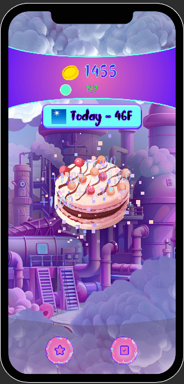
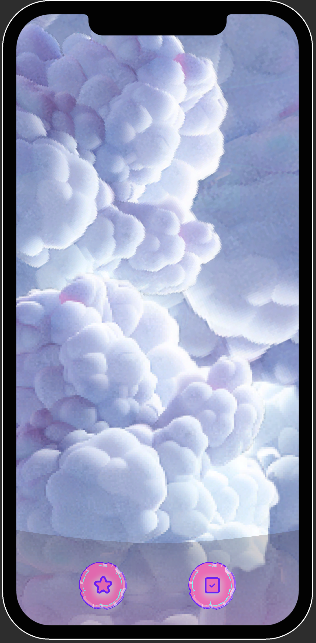
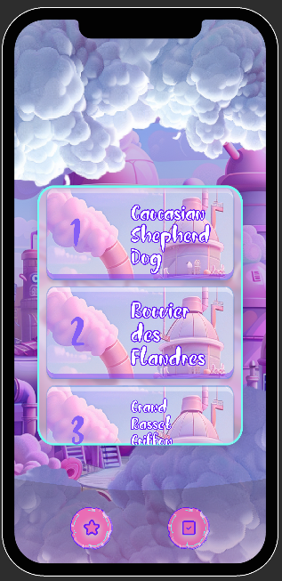
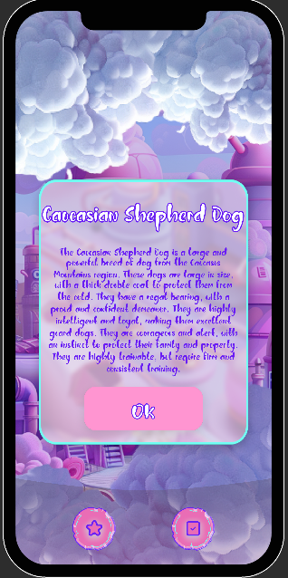

# Тестовое задание для оценки навыков работы с Unity и взаимодействием с Backend

## Цель задания
Цель данного тестового задания — оценить ваши навыки работы с технологиями Unity, а также умение взаимодействовать с серверной частью игры через отправку запросов и получение ответов.

## Требования
Для выполнения задания необходимо разработать простую игру-кликер с элементами взаимодействия с публичными API. Используемые технологии:

- Zenject
- UniRx + Unitask
- DOTween

**Запрещено использовать:**
- ECS

Требуемая версия Unity: 2022.3 и выше.

## Рекомендуемые паттерны проектирования
Рекомендуется использование следующих паттернов, но их использование опционально:

- MVC
- MVP
- Command
- Zenject Factory + Pool

## Структура приложения
Приложение состоит из двух вкладок с переключением через нижнюю навигационную панель:

1. **Вкладка кликер с погодой**
2. **Вкладка список фактов**

Переключение между вкладками должно происходить через затемнение игровой части, при этом сама панель навигации не должна темняться.

---

## Задание 1: Кликер

### Основные требования:
- В центре экрана находится кнопка. При её нажатии начисляется 1 единица валюты.
- Реализовать систему автосбора, при которой каждые 3 секунды к валюте добавляется 1 единица, даже если игрок ничего не делает.
- Внедрить систему энергии:
  - Энергия начисляется каждые 10 секунд по 10 единицам, максимальное значение — 1000.
  - Начальное значение энергии — 1000.
  - Каждый клик и автосбор затрачивают по 1 единице энергии.
- Реализовать визуальные эффекты (VFX) при нажатии на кнопку:
  - Партикл на разлет частиц
  - Анимация полета валюты наверх
  - Визуальный отклик самой кнопки
  - Звуковое сопровождение
- UI:
  - Окна должны быть адаптивными и подстраиваться под разные разрешения экранов.
  - Необходимо наличие счетчика валюты и энергии.

---

## Задание 2: Взаимодействие с сервером

### Общие требования:
Реализовать систему взаимодействия с сервером через очередь запросов, где каждый новый запрос выполняется после завершения предыдущего.
- Добавлять новые запросы в очередь и получать результат выполненного запроса.

#### Подзадание 2.1: Прогноз погоды
API: [https://api.weather.gov/gridpoints/TOP/32,81/forecast](https://api.weather.gov/gridpoints/TOP/32,81/forecast)

- Запрос на получение прогноза погоды должен выполняться каждые 5 секунд при наличии пользователя на вкладке кликера.
- Если пользователь уходит с вкладки и запрос уже отправлен, он должен быть отменен. Также из очереди должны удаляться все ожидающие запросы.
- После успешного получения данных о погоде отображать их в правом верхнем углу вкладки кликера в формате: (иконка погоды) Сегодня — 61F.

#### Подзадание 2.3: Список фактов
API: [https://dogapi.dog/docs/api-v2](https://dogapi.dog/docs/api-v2)

- При переходе на вкладку фактов добавлять запрос получения списка фактов в очередь.
- Показывать индикатор загрузки до завершения выполнения запроса.
- Отображать полученные факты в формате:

1 name
2 name и так далее

- Реализовать кликабельные факты, при нажатии на который добавляется новый запрос в очередь для получения подробной информации о выбранном факте.
- Показывать индикатор загрузки данных до завершения выполнения запроса. Если пользователь выбирает другой факт или уходит с вкладки, текущий запрос должен быть отменен и заменен новым.
- При успешном получении данных о выбранном факте отображать попап с названием факта и его описанием. Попап должен адаптироваться по высоте в зависимости от длины контента.

---